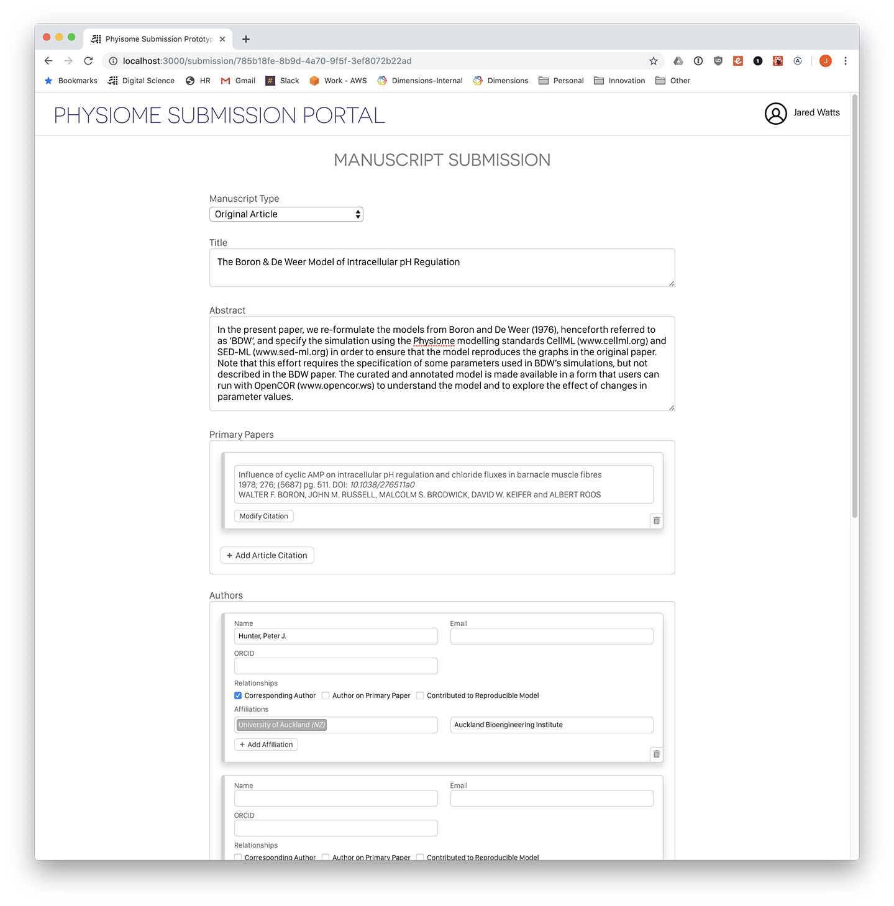
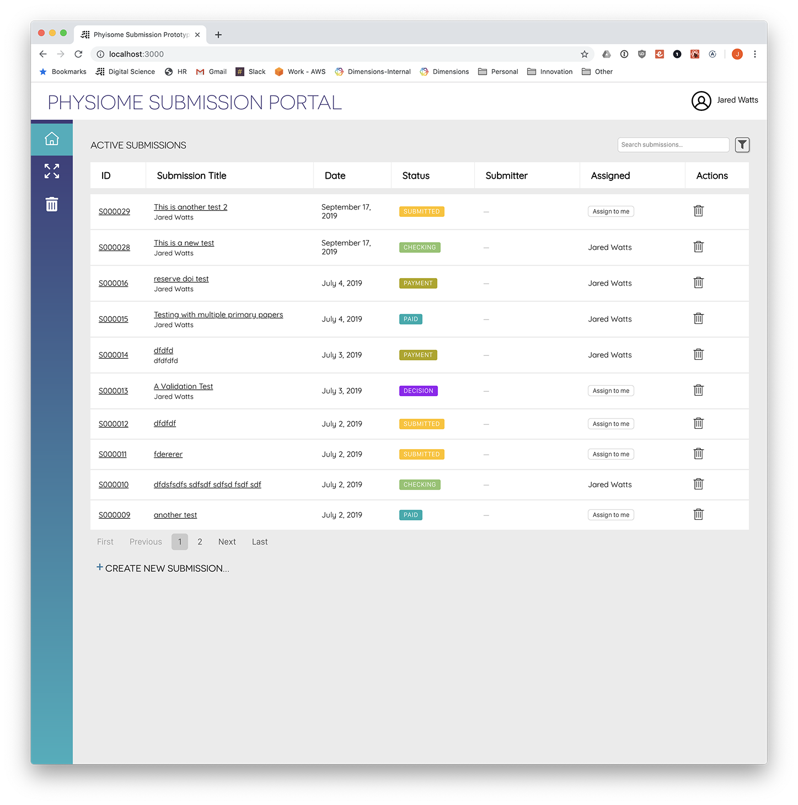
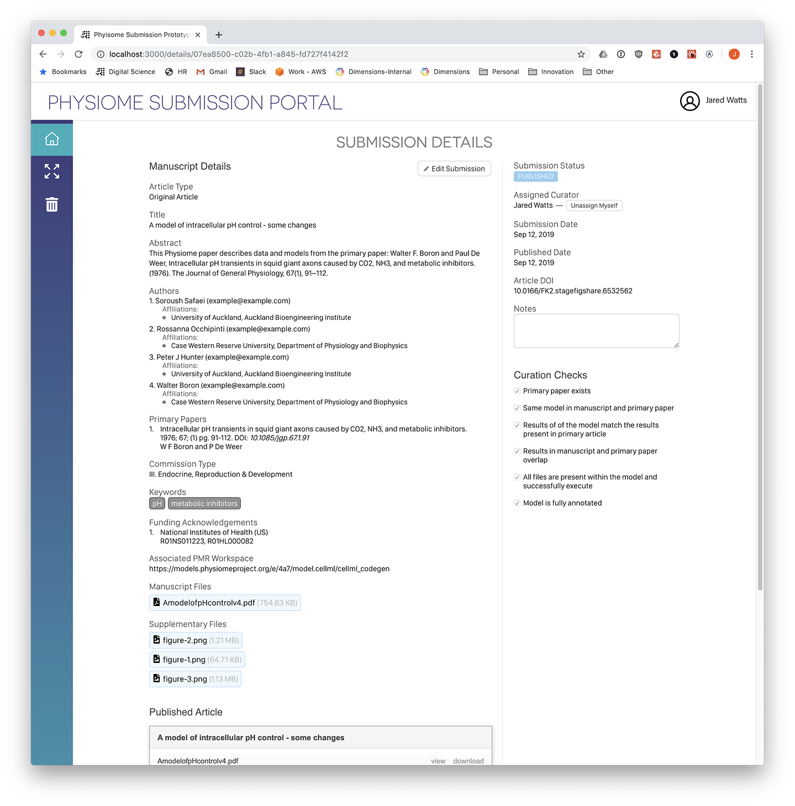

# Phyisome Submission System

_Physiome_ publishes reproducible and reusable mathematical models of physiological processes where the experimental details and model validation have been published or accepted for publication in a recognised 'primary' peer-reviewed journal.
Physiome curators will help authors ensure that models and simulation experiments are made available using appropriate community standards prior to acceptance for publication in Physiome.

More details about the Physiome Journal itself can be found here:<br />
<https://journal.physiomeproject.org><br />
<https://auckland.figshare.com/articles/Presentation_COMBINE2019_pdf/9037403>

The piece of software held in this repository is designed to facilitate the submission of manuscripts to the Physiome journal. Submitters
are able to upload their manuscript file, specify additional metadata such as authors, funding etc. and then submit
these to the journal for consideration. Subsequently, the journals curators able to use the administrative functions within the software
platform to manage submissions, make editorial modifications and finally publish accepted manuscripts and models through
into the Physiome figshare instance.

Videos showing briefly the functions of the software can be found on figshare here:
<https://figshare.com/articles/Physiome_Submission_System_-_example_videos/9868016>

This development utilises and builds upon the PubSweet application core managed by the Coko Foundation and wider PubSweet community.

PubSweet Project:<br />
<https://gitlab.coko.foundation/pubsweet/pubsweet>

Coko Foundation:<br />
<https://coko.foundation/>

## Getting Started

### Prerequisites

For local development the easiest way to get started is to have Docker installed and run the following services on Docker to link to the Physiome submission system instance.

 * NodeJS
 * Yarn
 * Docker (for local development ease)
 * Camunda BPM ([camunda/camunda-bpm-platform:latest](https://hub.docker.com/r/camunda/camunda-bpm-platform/)) 
 * Postgres ([postgres:latest](https://hub.docker.com/r/camunda/camunda-bpm-platform/))
 * Camunda Modeller ([download](https://camunda.com/download/modeler/)) - for viewing/modifying BPM model documents

### Services (local development)

Create a new Postgres instance
```console
docker run -d --name physiome-postgres -p 5432:5432 postgres:latest
```

Create a new Camunda BPM Engine instance
```console
docker run -d --name physiome-camunda -p 8080:8080 camunda/camunda-bpm-platform:latest
```

### Setup

From the root project directory perform the following
```console
yarn install
yarn dsl-compile
```

### Configuration

The application itself pulls configuration from several different locations:

 * Within the file <code>/packages/app/config/default.js</code> an overview and the default values utilised within the application can be found.
 * Run-time environment can also effect the aggregated configuration. The default configuration
 noted above is then supplemented with <code>/packages/app/config/test.js</code> for example when running
 in the "test" environment.
 * Environment variables for the NodeJS application are utilised in certain defaults. These
 environment variables can be provided at run-time or via the .env located <code>/packages/app/.env</code>

Example ".env" file for local development:

```
AWS_S3_ACCESS_KEY=<replace with S3 access key>
AWS_S3_SECRET_KEY=<replace with S3 secret key>
AWS_S3_REGION=<replace with S3 region>
AWS_S3_BUCKET=<replace with S3 bucket name>
ORCID_CLIENT_ID=<replace with ORCiD API client ID>
ORCID_CLIENT_SECRET=<replace with ORCiD API client secret>
AWS_SES_ACCESS_KEY=<replace with SES access key>
AWS_SES_SECRET_KEY=<replace with SES secret key>
AWS_SES_REGION=<replace with SES region>
FIGSHARE_API_BASE=<replace with figshare API base URL>
FIGSHARE_API_TOKEN=<replace with figshare API token>
```

 * The business logic is described within <code>/definitions/physiome-submission-v2.bpmn</code>. This file
 can be opened using the Camunda Modeler application. It describes the tasks and steps a submission
 goes through, including any "external tasks" such as sending an email or publishing to figshare.
 * The description of how these components all fit together (the glue so to speak) is defined within the file 
 <code>/definitions/physiome-submission.wfd</code>. This contains a custom domain-specific language that
 is "compiled" via PegJS into a JSON file representation. The compiled representation can be found
 within <code>/packages/app/config/description.json</code>
 
The minimum required to get this configured locally for testing things out is to create the .env
file and provide it with the required values for S3, SES and ORCID. The figshare options do
not need to be specified for local development purposes (unless you have access to a test figshare instance).

For deployment purposes or to utilise a database/BPM from another machine, it is also possible
to define a Postgres database and Camunda engine located elsewhere using the following environment
variables:

```
DATABASE=<postgres database name>
DB_USER=<postgres username>
DB_PASS=<postgres password>
DB_HOST=<postgres server hostname>
WORKFLOW_API_URI=http://<camunda hostname>:8080/engine-rest

```

## Deployment

We need to compile the current "Workflow Description". This will use the PegJS created processor to
read in the file <code>/definitions/award-submission.wfd</code> and process it into the description JSON
file located within <code>/packages/app/config/description.json</code>
```console
yarn desc
```

In order for Camunda to know about the business logic model we wish to use, it needs to be deployed to the Camunda instance.
This will happen automatically as part of a Knex database migration script.


## Running

With all of the above configured and deployed it is now possible to run the application.

From the root directory of the project, run the following command:
```console
yarn start
```

This will kick off the initial database setup steps (including BPM deployments) and then run the backend GraphQL endpoint. It will also run webpack
over the front-end application and expose it for testing.

Navigate in your local browser of preference to: [http://localhost:3000](http://localhost:3000)

## Notes

The code relating to how the DSL language takes the data model and transforms this into a representation 
used within the PubSweet core is in need of a refactoring, so please ignore the code smell that lingers in these parts.


## Videos/Screenshots

Screenshot: Manuscript submission form


Screenshot: Administration view with submissions listing


Screenshot: Administration view, submission details


Video: basic run through of functionality
<video controls="" autoplay="" name="media" style="max-width: 600px;"><source src="https://ndownloader.figshare.com/files/17694719/preview/17694719/video_preview.mp4" type="video/mp4"></video>

## Contact

Please feel free to contact Jared Watts (j.watts@digital-science.com) about this project. To contact the Physiome journal, physiome@physiomeproject.org.